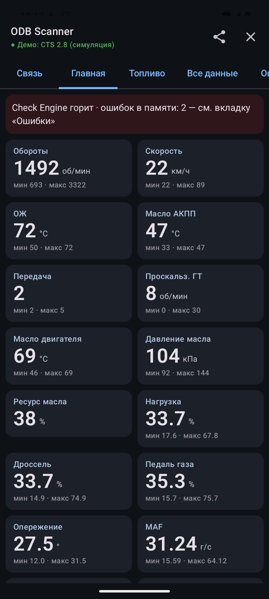

# ODB Scanner

Android-приложение для чтения данных из машины через ELM327 (Bluetooth). Сделано под Cadillac CTS 2-го поколения (2.8 V6, АКПП 6L50). Стандартная часть работает с любой машиной на CAN.



## Что читает

При подключении:
- Mode 01 — все поддерживаемые PID всех ответивших блоков;
- Mode 09 — VIN, калибровки, CVN, имена блоков, счётчики мониторов;
- ошибки 03 / 07 / 0A, стоп-кадр (Mode 02);
- готовность мониторов;
- Mode 06 — все бортовые тесты, включая пропуски по цилиндрам;
- GM Mode $22 — ~45 известных параметров, дальше опрашиваются ответившие;
- GM $A9 — ошибки всех блоков HS-CAN. Модули ищутся при первом подключении (~1 мин) и запоминаются по VIN, дальше несколько секунд на блок. После этого адаптер проверяется (`0100`), при необходимости переинициализируется.

## Вкладки

| Вкладка | Содержимое |
|---|---|
| Связь | Спаренные адаптеры, демо-режим |
| Главная | Основные параметры по цветным секциям (двигатель, масло, АКПП, топливо, электрика), мин/макс за сессию |
| Топливо | Коррекции, датчики O2, λ, зажигание, детонация, таблица по цилиндрам, расход, катализаторы, EVAP, подсказки |
| Все данные | Все значения всех блоков |
| Ошибки | Чтение, сброс (с подтверждением), стоп-кадр; полная память ошибок всех блоков GM ($A9) |
| Инфо | Адаптер, VIN, блоки, готовность, Mode 06 |
| GM-скан | Поиск модулей, скан DID $1A/$22, отслеживание, прослушка шины |
| Сессии | Список сессий, отправка, удаление |

Касание карточки на «Главной» открывает справку: значение, мин/макс, откуда берётся, «Что это / Норма / Если не так». Тексты — в `app/src/main/res/values/help_*.xml` (по файлу на секцию) и `strings.xml`. Для перевода: скопировать их в `values-en/` и перевести. Правило для текстов: только проверенное (стандарт, источники, логи этой машины). Чего не знаем — так и пишем.

## Сессии

Каждое подключение — папка сессии, запись с первой команды.

| Файл | Содержимое |
|---|---|
| `raw.log` | Весь обмен с адаптером с временем |
| `data.csv` | Декодированные значения; при изменении, иначе не чаще 1 раза/с |
| `report.txt` | Сводка: версия, адаптер, протокол, PID, VIN, ошибки, Mode 06, GM, модули |
| `scan.csv` | Находки GM-скана |
| `bus.csv` | Кадры прослушки шины |

⇪ в заголовке — zip текущей (или последней) сессии и «Поделиться». Для старых — вкладка «Сессии».

## Адаптер и машина

- ELM327 с классическим Bluetooth. Спарить в настройках Android, PIN `1234` или `0000`.
- Только CAN (ISO 15765-4).
- Сбои клонов обрабатываются: проверка порядка кадров ISO-TP, повтор битых ответов, повтор команд после `STOPPED`.

Шины CTS 2008–2014:
- HS-CAN (пины 6/14, 500 кбит/с): двигатель, АКПП, ABS, BCM и др. — доступны;
- GMLAN SW-CAN (пин 1, 33 кбит/с): подушки, приборка, радио, климат, TPMS, парктроники — ELM327 недоступны, нужен адаптер с SW-CAN (OBDLink MX+).

## GM-параметры

Таблица: [GmKnown.kt](app/src/main/java/com/odbscanner/gm/GmKnown.kt). Источники: Holden VE/VF, списки GM Class 2, OBDb.
- без пометки — несколько источников или проверено на машине;
- «(?)» — один источник или расхождения.

Проверено на машине: 22 1940 (масло АКПП), 22 1941 (входной вал, ×0.125), 22 1991 (проскальзывание ГТ), 22 1141 (IGN1), 22 11A1 (время работы).

## GM-скан и прослушка

- Поиск модулей — опрос ~40 диагностических адресов HS-CAN, затем идентификация каждого найденного модуля ($1A: имя, дата программирования, номера программ и детали) — в `scan.csv` и `report.txt`.
- Ошибки всех блоков («Ошибки» → «Прочитать все блоки») — GMLAN `$A9 81` с маской `5A` (активные, история, после сброса) в каждый найденный модуль. В отличие от Mode 03 показывает коды без Check, коды ABS/BCM и байт типа отказа (`C0035 5A`). Коды приходят UUDT-кадрами на `0x5xx`, поэтому на время запроса адаптер переключается в `ATCAF0`, потом восстанавливается. Только чтение, ничего не стирается.
- Скан $1A / $22 — перебор DID выбранного модуля, только чтение, результат в `scan.csv`. Галочка — опрос DID в реальном времени.
- Прослушка шины — пассивная (`ATCSM1`, `ATMA`): ~10 с обзор ID, затем по 1.5 с на каждый ID через фильтр. Результат в `bus.csv`, сводка в `report.txt`. Только по кнопке; после неё адаптер возвращается в обычный режим.

Сканы и прослушку делать на стоящей машине.

## Сборка

Нужны Android SDK (в скриптах `E:\Android\Sdk`), JDK 17, телефон с отладкой по USB.

VS Code (Ctrl+Shift+P → Tasks: Run Task):

| Задача | Действие |
|---|---|
| ODB: Run on Phone (Ctrl+Shift+B) | Сборка, установка, запуск. Выбирает физический телефон; другое устройство — `-Serial` |
| ODB: Logcat (ODB) | Лог обмена с адаптером (тег `ODB`) и падений |
| ODB: Unit tests | Тесты |

Консоль:

```
gradlew assembleDebug        # APK: app/build/outputs/apk/debug/ODBScanner_PavelArkhipov_<версия>.apk
gradlew installDebug         # сборка и установка
gradlew testDebugUnitTest    # тесты
```

Версия — в заголовке приложения и в `report.txt`. Поднимать `versionName` и `versionCode` в [app/build.gradle.kts](app/build.gradle.kts) с каждой сборкой.

## Демо-режим

Вкладка «Связь» → «Демо-режим»: эмулятор ELM327 v1.5 + CTS 2.8 ([MockTransport.kt](app/src/main/java/com/odbscanner/transport/MockTransport.kt)). Двигатель, АКПП, BCM, многокадровые ответы, ошибки, Mode 06, GM-параметры, трафик для прослушки. На нём же unit-тесты.

## Код

```
app/src/main/java/com/odbscanner/
├── ObdManager.kt    подключение, опрос, цикл чтения, действия
├── ObdService.kt    фоновый сервис (запись при выключенном экране)
├── MainActivity.kt  заголовок, вкладки
├── transport/       Bluetooth SPP, эмулятор
├── elm/             драйвер ELM327, разбор CAN/ISO-TP, адресация
├── obd/             PID и формулы, ошибки, Mode 06, Mode 09, готовность
├── gm/              GM-параметры, поиск модулей, скан DID
├── bus/             прослушка шины
├── session/         запись сессий, zip
└── ui/              экраны (Jetpack Compose)
```

Исходник иконки: [art/icon.png](art/icon.png).
